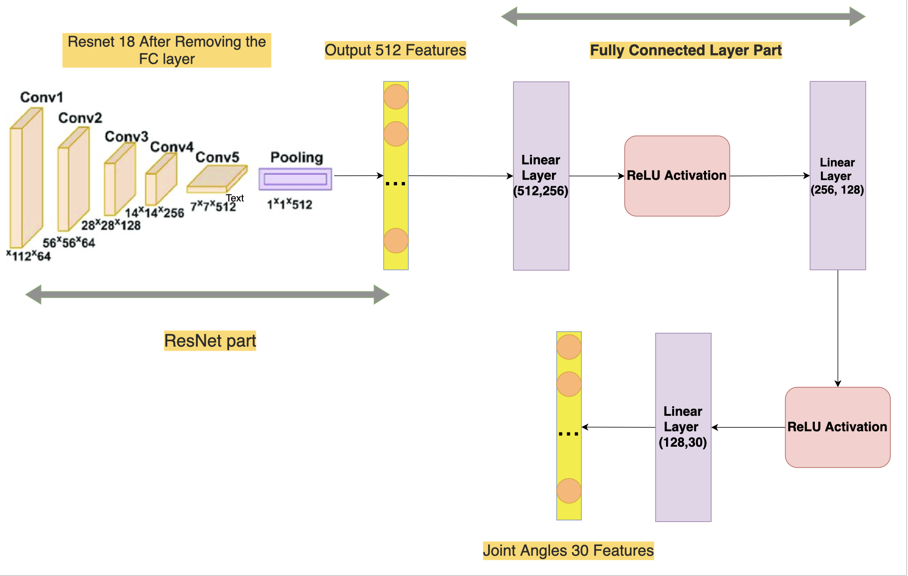
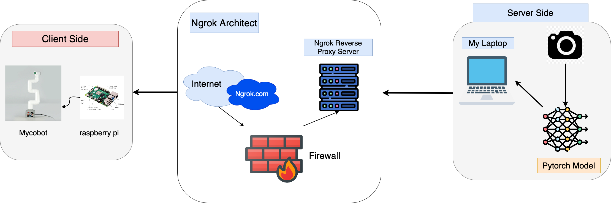

# **Robot Arm For Object Classification**

## 📋 <a name="table">Table of Contents</a>

1. 🤖 [Introduction](#introduction)
2. ⚙️ [Tech Stack](#tech-stack)
3. 🔋 [Features](#features)
4. 📂 [Dataset](#dataset)
5. 🧠 [Model Architecture](#model-architecture)
6. 🎨 [System Design](#system-design) 
7. 🤸 [Quick Start](#quick-start)
8. 🎬 [Documentation and Demo](#documentation-and-demo)

## <a name="introduction">🤖 Introduction</a>
This project uses the MyCobot 280 Pi robotic arm to classify and sort different cubes into their corresponding boxes based on their colors. It integrates:
- **Deep learning** to generate actions from images captured by the camera.
- **WebSocket communication** for real-time control.
- **Mycobot 280 Pi** to execute the task.

## <a name="tech-stack">⚙️ Tech Stack</a>
- PyTorch
- PyMyCobot
- ROS 2
- Ngrok
- WebSocket

## <a name="features">🔋 Features</a>
- 👉 **Real-Time Detection and Classification**: The robot detects colored cubes and classifies them into their respective boxes based on color.
- 👉 **Custom Dataset Creation**: Supports datasets with structured images and joint angle mappings. The dataset is easily extendable for more complex detection tasks, such as handling multiple objects within the same region.
- 👉 **WebSocket Communication**: Provides smooth, real-time communication between the laptop and MyCobot robotic arm.


## <a name="dataset">📂 Dataset</a>
The dataset was initially built through direct teaching. Later, I used ROS 2 to collect action data. If needed, you can add more data.

The dataset consists of folders, each representing an action. Each folder contains:  
- `image.png`: Input image (190×190).  
- `joint_angles.json`: Corresponding joint angles matrix (5×7) (the last column indicating the gripping status will be eliminated during training).  

Example:
```
dataset/
  ├── action_1/
  │   ├── image.png
  │   └── joint_angles.json
  ├── action_2/
  │   ├── image.png
  │   └── joint_angles.json
  └── ...
```

## <a name="model-architecture">🧠 Model Architecture</a>
### **Model Overview**
The model combines a pre-trained ResNet18 backbone for feature extraction with fully connected layers to predict joint angles in a 5×6 matrix.
- **Input**: RGB image (224x224).
- **Output**: 5x6 matrix representing joint angles.

### **Model Diagram**
<div align="center">
    
</div>


### **Training Details**
- **Loss Function**: Mean Squared Error (MSE).
- **Optimizer**: Adam.
- **Key Hyperparameters**: Batch size: 32, Learning rate: 0.001.

## <a name="system-design">🎨 System Design</a>
### **WebSocket Communication**
The system uses WebSocket to connect the laptop and MyCobot via a public server.

### **System Flow**
1. **Laptop**: Captures an image, predicts joint angles, and sends data via WebSocket.
2. **Server**: Processes and forwards commands.
3. **MyCobot**: Executes actions based on received joint angles.

### **System Diagram**

<div align="center">
  
</div>

## <a name="quick-start">🤸 Quick Start</a>
### **Prerequisites**
- Python 3.8+
- MyCobot 280 Pi with Raspberry Pi 4 OS.
- Ngrok

### **Setup Instructions**
**In your laptop, run:**
1. **Clone the Repository s**:  
   ```bash
   git clone https://github.com/maixuanbach174/CobotVision.git
   cd cobotvision
   ```
2. **Install Dependencies**:  
   ```bash
   pip3 install -r requirements.txt
   ```
3. **Run the Server (in your laptop)**:  
   ```bash
   python3 server.py
   ```
4. **Run Ngrok (in your laptop)**:
   ```bash
   ngrok http 8080
   ```
**In your MyCobot 280 Pi, run:**
   ```bash
   python3 client.py
   ```

## <a name="documentation-and-demo">🎬 Documentation and Demo</a>
- **Documentation**: [Access Full Documentation](https://drive.google.com/drive/folders/1nFd4ICqx4hJGKHwVYaWBma3THM6Y9WxF?usp=sharing)
- **Demo Video**: [Watch the Demo](https://drive.google.com/file/d/1u5-GVWBgHqCi0q3EZ7wy4EoEVWH-fP6O/view?usp=sharing)
- **My Repository**: [GitHub Repository](https://github.com/maixuanbach174)
